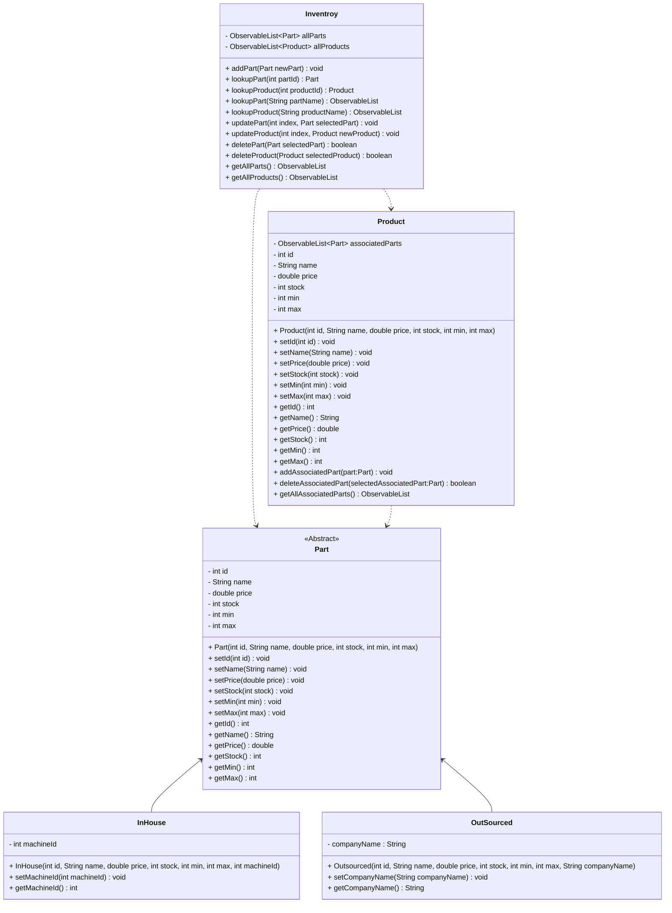

```mermaid
classDiagram
    Inventroy ..> Part
    Inventroy ..> Product
    Product ..> Part
    Part <-- InHouse
    Part <-- OutSourced

    class Inventroy {
        - ObservableList~Part~ allParts
        - ObservableList~Product~ allProducts
        + addPart(Part newPart) void
        + lookupPart(int partId) Part
        + lookupProduct(int productId) Product
        + lookupPart(String partName) ObservableList<Part>
        + lookupProduct(String productName) ObservableList<Product>
        + updatePart(int index, Part selectedPart) void
        + updateProduct(int index, Product newProduct) void
        + deletePart(Part selectedPart) boolean
        + deleteProduct(Product selectedProduct) boolean
        + getAllParts() ObservableList<Part>
        + getAllProducts() ObservableList<Product>
    }
    class Product {
        - ObservableList~Part~ associatedParts
        - int id
        - String name
        - double price
        - int stock
        - int min
        - int max
        + Product(int id, String name, double price, int stock, int min, int max)
        + setId(int id) void
        + setName(String name) void
        + setPrice(double price) void
        + setStock(int stock) void
        + setMin(int min) void
        + setMax(int max) void
        + getId() int
        + getName() String
        + getPrice() double
        + getStock() int
        + getMin() int
        + getMax() int
        + addAssociatedPart(part:Part) void
        + deleteAssociatedPart(selectedAssociatedPart:Part) boolean
        + getAllAssociatedParts() ObservableList<Part>
    }
    class Part {
        <<Abstract>>
        - int id
        - String name
        - double price
        - int stock
        - int min
        - int max
        + Part(int id, String name, double price, int stock, int min, int max)
        + setId(int id) void
        + setName(String name) void
        + setPrice(double price) void
        + setStock(int stock) void
        + setMin(int min) void
        + setMax(int max) void
        + getId() int
        + getName() String
        + getPrice() double
        + getStock() int
        + getMin() int
        + getMax() int
    }
    class InHouse {
        - int machineId
        + InHouse(int id, String name, double price, int stock, int min, int max, int machineId)
        + setMachineId(int machineId) void
        + getMachineId() int
    }
    class OutSourced {
        - companyName : String
        + Outsourced(int id, String name, double price, int stock, int min, int max, String companyName)
        + setCompanyName(String companyName) void
        + getCompanyName() String
    }
```